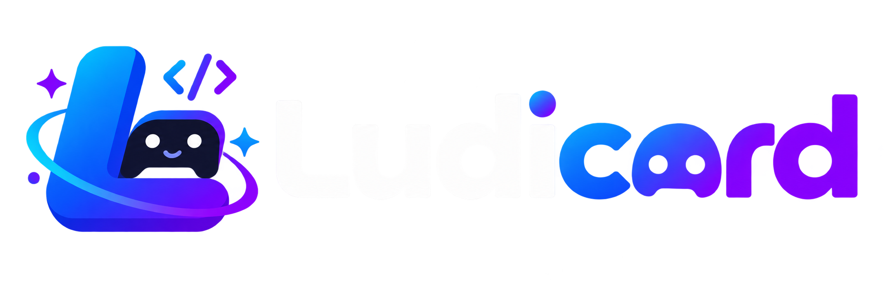

<p align="center">
  
</p>

<h1 align="center">Ludicord</h1>

<p align="center">A full-stack React framework built specifically for Discord Activities.</p>

<p align="center">
  <a href="https://www.npmjs.com/package/ludicord"></a>
  <a href="https://www.npmjs.com/package/ludicord"></a>
  
  
  
  <a href="SECURITY.md"></a>
</p>

<p align="center">
  <a href="docs/README.md">Documentation</a> ·
  <a href="docs/getting-started.md">Get started</a> ·
  <a href="CHANGELOG.md">Changelog</a> ·
  <a href="ROADMAP.md">Roadmap</a> ·
  <a href="SUPPORT.md">Support</a>
</p>

## Start an Activity

Requires Node.js 20.19+ and React/React DOM 18.3 or 19.

```bash
npx create-ludicord-app@latest my-activity
cd my-activity
npm run dev
```

The interactive creator can add Tailwind CSS, or you can choose directly:

```bash
npx create-ludicord-app@latest my-activity --tailwind
npx create-ludicord-app@latest my-activity --no-tailwind
```

Then add Discord credentials to `.env.local`, configure an HTTPS tunnel and set Activity URL Mapping in the Discord Developer Portal. Never commit secrets. Follow the [complete getting-started guide](docs/getting-started.md).

## Made for Discord Activities

- File-based embeds with persistent Activity state and internal navigation.
- Authenticated HTTP APIs, WebSocket routes and activity-scoped rooms.
- Official Discord Embedded App SDK integration, participants, voice/layout events and typed helpers.
- Automatic loading, error, auth and minimize UI connected by framework convention.
- API and WebSocket hot updates without restarting the development server.
- Source-mapped diagnostics, a custom browser error panel and Ludicord-branded compile timing.
- Production builds with secret scanning, sanitized errors and explicit deployment checks.

```tsx
// app/embeds/home/embed.tsx
import { useDiscordUser, useParticipants } from "ludicord/discord";

export default function embed() {
  const user = useDiscordUser();
  const participants = useParticipants();

  return <h1>Hello {user?.displayName ?? "player"} — {participants.length} connected</h1>;
}
```

## Framework conventions

`app/pages.tsx` owns one `LudicordActivity` and one `EmbedOutlet`. Ludicord discovers `app/layout.tsx`, loading/error/minimize files and `app/auth/*` automatically—do not wire them into `pages.tsx`. Embeds live at `app/embeds/<route>/embed.tsx` and default-export `function embed()`.

Use `app/api/**/route.ts` for HTTP handlers and `app/ws/**/route.ts` for WebSockets. The framework replaces API and WebSocket modules during development after a successful rebuild. Run `ludicord doctor`, `ludicord routes`, `npm run typecheck` and `npm run build` before shipping.

## Documentation map

| Build | Discord | Server | Ship |
| --- | --- | --- | --- |
| [Project structure](docs/project-structure.md) | [SDK and context](docs/discord-sdk.md) | [API routes](docs/api-routes.md) | [Build](docs/build.md) |
| [Pages and automatic files](docs/pages.md) | [Participants](docs/participants.md) | [WebSockets](docs/websockets.md) | [Deployment](docs/deployment.md) |
| [Embeds](docs/embeds.md) | [Voice events](docs/voice-events.md) | [Activity rooms](docs/activity-rooms.md) | [Security](docs/security.md) |
| [Navigation](docs/navigation.md) | [Developer Portal](docs/discord-developer-portal.md) | [Authentication](docs/login.md) | [Troubleshooting](docs/troubleshooting.md) |

## Built for humans and coding agents

The repository includes a reusable [Ludicord agent skill](skills/ludicord/SKILL.md), [agent rules](AGENTS.md) and an [LLM documentation index](llms.txt). They teach coding agents the framework's file conventions, security boundaries and validation workflow before they modify an Activity.

## Releases and distribution

`ludicord` and `create-ludicord-app` are versioned together. Release automation publishes immutable, reviewed tarballs from this public repository through npm trusted publishing, verifies registry integrity, creates the tag and GitHub release, updates the public changelog, and sends a Discord Components V2 announcement.

The original TypeScript implementation and private application code are not hosted here. Public release payloads contain the same compiled JavaScript and declarations already distributed through npm; source maps, credentials and private history are excluded. Read [distribution and release security](docs/distribution.md).

Ludicord uses the official Discord SDK. It is not a Discord Gateway client or bot runtime. Discord data depends on your application's scopes, permissions and configuration. Ludicord is not affiliated with or endorsed by Discord.
